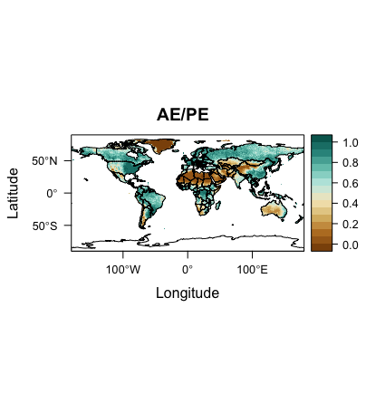
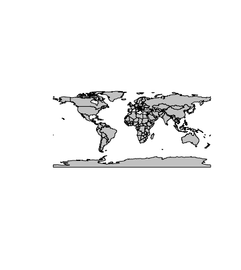

#Surface Air Temperature

Alpha (AE/PE) was read from "cru10min30_bio.nc" and contains: 

class       : RasterLayer  
dimensions  : 360, 720, 259200  (nrow, ncol, ncell)  
resolution  : 0.5, 0.5  (x, y) 
extent      : -180, 180, -90, 90  (xmin, xmax, ymin, ymax)  
coord. ref. : +proj=longlat +datum=WGS84 +ellps=WGS84 +towgs84=0,0,0  
data source : /Users/jacobmaurer/Documents/College/Geography490/Projects/cru10min30_bio.nc
names       : Priestley.Taylor..alpha..parameter..AE.PE.  
zvar        : mipt  

data source: /Users/jacobmaurer/Documents/College/Geography490/Projects/geog490/PMIP3_tas_1pctCO2_ltm_gcm_CMIP5_CCSM4_OA.nc
