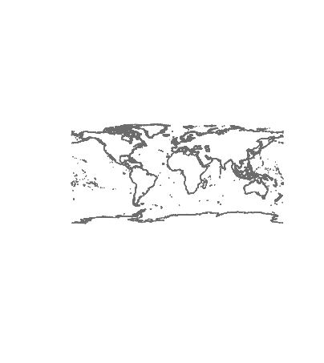
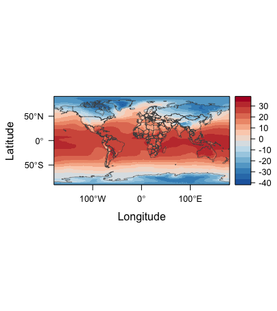

#Surface Air Temperature

This is the outline that was used to shows the countries in the world

 

This is the coastal outlines of the countries

This is a Surface Air Temperature look at one percent Co2 levels

This is the monthly look at one percent Co2 SAT

