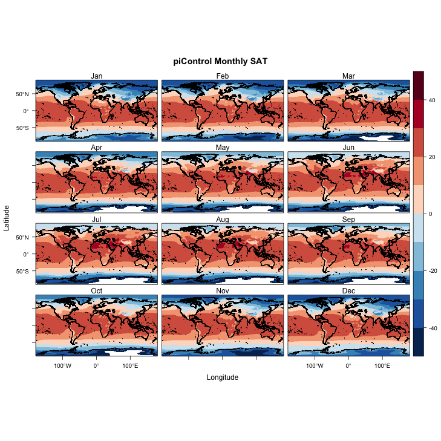
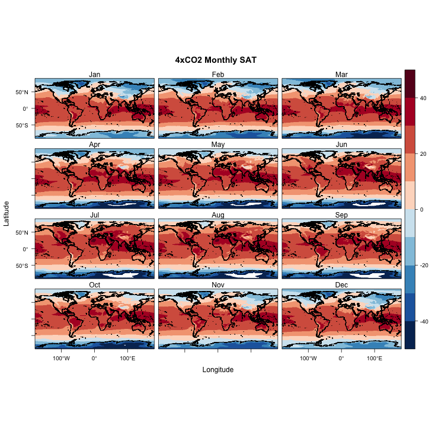

#Surface Air Temperature
#introduction
This is the data used for the 1 x Co2
```{r, plot_data0, message=FALSE}

library(ggplot2)
library(ncdf4)
library(zoo)
library(RColorBrewer)
library(raster)
library(rasterVis)
library(sf)
library(ncdf.tools)
library(rgdal)

nc_path <- "/Users/jacobmaurer/Documents/College/Geography490/Projects/geog490//"
nc_name <- "PMIP3_tas_piControl_ltm_gcm_CMIP5_CCSM4_OA.nc"

nc_file <- paste(nc_path, nc_name, sep="")

tas_piControl <- raster(nc_file, varname = "tas_ltm")

tas_piControl <- rotate(tas_piControl)

shp_path <- "/Users/jacobmaurer/Documents/College/Geography490/Projects/geog490//"
```


#This is the data for the 4 x Co2
```{r, plot_data1}

nc_path <- "/Users/jacobmaurer/Documents/College/Geography490/Projects/geog490//"
nc_name <- "PMIP3_tas_abrupt4xCO2_ltm_gcm_CMIP5_CCSM4_OA.nc"

nc_file <- paste(nc_path, nc_name, sep="")

tas_4xC02 <- raster(nc_file, varname = "tas_ltm")

tas_4xC02 <- rotate(tas_4xC02)

shp_path <- "/Users/jacobmaurer/Documents/College/Geography490/Projects/geog490//"
```


# Country Outlines
This is the outline that was used to shows the countries in the world
```{r, plot_data2}

shp_path <- "/Users/jacobmaurer/Documents/College/Geography490/Projects/geog490//"
shp_name <- "ne_110m_admin_0_countries.shp"
shp_file <- paste(shp_path, shp_name, sep="")
world_shp <- read_sf(shp_file)
world_outline <- as(st_geometry(world_shp), Class="Spatial")

plot(world_outline, col="gray80", lwd=1)
```


## Coastal Outline
This is the coastal outlines of the countries
```{r, plot_data3}

coast_shp_path <- "/Users/jacobmaurer/Documents/College/Geography490/Projects/geog490//"
coast_shp_name <- "ne_10m_coastline.shp"
coast_shp_file <- paste(coast_shp_path, coast_shp_name, sep="")

# read the shapefile
coast_shp <- read_sf(coast_shp_file)
coast_outline <- as(st_geometry(coast_shp), Class="Spatial")

# plot the outline
plot(coast_outline, col="gray50", lwd=1)
```


This is a Surface Air Temperature look at present day
```{r, plot_data4}

mapTheme <- rasterTheme(region=rev(brewer.pal(8,"RdBu")))
plt <- levelplot(tas_piControl, margin=F, par.settings=mapTheme)
plt + latticeExtra::layer(sp.lines(world_outline, col="gray30", lwd=0.5))
```


This is 4x C02 
```{r, plot_data5}

mapTheme <- rasterTheme(region=rev(brewer.pal(8,"RdBu")))
plt <- levelplot(tas_4xC02, margin=F, par.settings=mapTheme)
plt + latticeExtra::layer(sp.lines(world_outline, col="gray30", lwd=0.5))
```


This is the monthly look at piControl, or present day
```{r, plot_data6}

monthly_piControl <- stack(nc_file, varname = "tas_ltm")
monthly_piControl
monthly_piControl <- rotate(monthly_piControl)
monthly_piControl
names(monthly_piControl) <- c("Jan","Feb","Mar","Apr","May","Jun","Jul","Aug","Sep","Oct","Nov","Dec")

# too big tp plot to RStudio's Plot window, so send to file:
pngfile <- "monthly_piControl.png"
png(pngfile, width=729, height=729) # open the file
cutpts <- c(-50,-40,-30,-20,-10,0,10,20,30,40,50)
plt <- levelplot(monthly_piControl, at=cutpts, cuts=11, pretty=T, 
                 col.regions=rev((brewer.pal(10,"RdBu"))))
plt + latticeExtra::layer(sp.lines(coast_outline, col="black", lwd=0.5))
dev.off()
```



```{r, plot_data7}

monthly_4xC02 <- stack(nc_file, varname = "tas_ltm")
monthly_4xC02
monthly_4xC02 <- rotate(monthly_4xC02)
monthly_4xC02
names(monthly_4xC02) <- c("Jan","Feb","Mar","Apr","May","Jun","Jul","Aug","Sep","Oct","Nov","Dec")

# too big tp plot to RStudio's Plot window, so send to file:

pngfile <- "monthly_4xC02.png"
png(pngfile, width=729, height=729) # open the file
cutpts <- c(-50,-40,-30,-20,-10,0,10,20,30,40,50)
plt <- levelplot(monthly_4xC02, at=cutpts, cuts=11, pretty=T, 
                 col.regions=rev((brewer.pal(10,"RdBu"))))
plt + latticeExtra::layer(sp.lines(coast_outline, col="black", lwd=0.5))
dev.off()
```




This is the difference between the 4x C02 and the present day
```{r, plot_data8}
monthly_diff <- monthly_4xC02 - monthly_piControl
pngfile <- "monthly_diff.png"
png(pngfile, width=729, height=729) # open the file
cutpts <- c(-10,-5,-2,-1,-0.5,0,0.5,1,2,5,10)
plt <- levelplot(monthly_diff, at=cutpts, cuts=11, pretty=T, 
                 col.regions=rev((brewer.pal(10,"RdBu"))))
plt + latticeExtra::layer(sp.lines(coast_outline, col="black", lwd=0.5))
dev.off()
```

